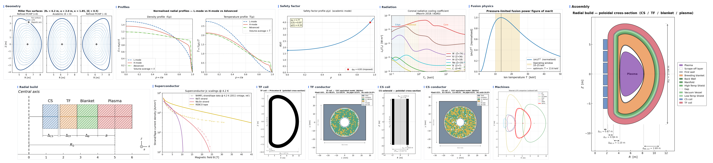

<a name="readme-top"></a>

<p align="center">
  
</p>

<h1 align="center">D0FUS</h1>

<p align="center">
  <a href="https://cecill.info/licences/Licence_CeCILL-C_V1-en.html"></a>
  <a href="https://pypi.org/project/d0fus/"></a>
</p>

<p align="center">
  
</p>

<p align="center">
  <sub>Top: plasma geometry (Miller surfaces), kinetic profiles, safety factor, radiative cooling, and fusion reactivity. Bottom: radial build, superconductor critical current, TF and CS coil cross-sections, CICC conductors, and a multi-machine comparison. Right: the full poloidal radial build, from plasma out to the TF coil.</sub>
</p>

**D0FUS** (Design 0-dimensional for Fusion Systems) is a Python tokamak systems code for fast 0D/1D design-space exploration, covering plasma physics, superconducting magnet engineering, and techno-economic assessment. It is developed at CEA-IRFM.

The codebase weighs about 35 000 lines of pure Python, organised into a core library (five functional modules plus a visualisation library, close to 300 documented functions) and a five-mode execution layer.

---

## Highlights

- **Pure Python**, NumPy/SciPy only. No compilation, no Makefile, runs in Spyder, Jupyter or as a batch job.
- **Two fidelity levels** (Academic and Refined) bundled by `preset_academic()` / `preset_refined()` factory functions, with each model carrying its own selector inside `GlobalConfig` for fine-grained control.
- **Five execution modes** (RUN, SCAN, OPTIMIZATION, POPCON, UNCERTAINTY) auto-detected from the input file syntax.
- **Library mode**: every physical and engineering function is callable in isolation, outside the solver loop.
- **Distinctive engineering features**: radially graded TF coils, REBCO Jc scaling laws, three TF mechanical configurations (bucking, wedging, plug).

---

## Installation

Three installation options are available. **Option A is recommended for most users** (no prior Python knowledge required).

---

### Option A: Spyder standalone (recommended)

This is the simplest path. Spyder comes with its own bundled Python, with no separate Python installation needed.

#### Step 1: Download and install Spyder

Go to [spyder-ide.org](https://www.spyder-ide.org/) and download the installer for your operating system (Windows, macOS, or Linux). Run the installer and follow the on-screen instructions. Default settings are fine.

#### Step 2: Download D0FUS

**If you have git installed**, open a terminal (macOS/Linux) or Command Prompt (Windows) and run:
```bash
git clone https://github.com/IRFM/D0FUS.git
```

**Otherwise**, go to [github.com/IRFM/D0FUS](https://github.com/IRFM/D0FUS), click **Code → Download ZIP**, and extract the archive somewhere on your computer (e.g. `C:\Users\you\D0FUS\` on Windows or `~/D0FUS/` on macOS/Linux).

#### Step 3: Open Spyder

Launch Spyder from your applications menu (or desktop shortcut). You should see a layout with a code editor on the left, a file explorer on the top right, and an **IPython console** on the bottom right.

#### Step 4: Open D0FUS.py in Spyder

Go to **File → Open…** and open `D0FUS.py` from the `D0FUS/` folder. Spyder will automatically set the working directory to `D0FUS/`. You can confirm this by checking the folder path displayed in the toolbar at the top.

#### Step 5: Install dependencies

In the **IPython console** (bottom-right panel), type the following and press **Enter**:

```
%pip install -r requirements.txt
```

The `%pip` magic command installs packages directly into Spyder's internal Python. Since the Spyder standalone bundles its own pip, no prior installation is needed. Since the working directory is already set to `D0FUS/`, no path specification is needed. Wait for all packages to finish installing.

> **If `%pip` fails**, try: `!pip install -r requirements.txt`. If pip itself is missing (unlikely with the standalone), reinstalling Spyder usually fixes it.

#### Step 6: Run D0FUS

Press **F5** (or click the green ▶ **Run file** button). A file-picker dialog will appear. Navigate to `D0FUS_INPUTS/` and select `1_run_ITER.txt`. D0FUS will run and print results to the IPython console. Figures will open automatically.

---

### Option B: Miniforge (for advanced users)

[Miniforge](https://github.com/conda-forge/miniforge) is a free, community-maintained conda distribution with no commercial restrictions. Recommended if you manage multiple Python projects.

**Install Miniforge**, then open a Miniforge Prompt (Windows) or terminal (macOS/Linux):

```bash
conda create -n d0fus python=3.11
conda activate d0fus
conda install pip
conda install spyder
git clone https://github.com/IRFM/D0FUS.git
cd D0FUS
pip install -r requirements.txt
spyder
```

Once Spyder is open, follow Steps 5–6 from Option A. Alternatively, run directly from the terminal:

```bash
python D0FUS.py
# When prompted, enter the path to the input file:
# D0FUS_INPUTS/1_run_ITER.txt
```

---

### Option C: pip install (headless / script integration)

For use without a GUI, or to import D0FUS as a library in your own scripts:

```bash
pip install d0fus
```

To run the ITER example case from a script:

```python
from D0FUS_EXE import D0FUS_run

results = D0FUS_run.run("D0FUS_INPUTS/1_run_ITER.txt")
print(f"Q = {results['Q']:.1f},  COE = {results['COE']:.0f} EUR/MWh")
```

> Note: input files (`D0FUS_INPUTS/`) are not included in the PyPI package. Clone the repository separately to access them.

---

## Project Structure

```
D0FUS/
├── D0FUS_BIB/                          # Core library modules
│   ├── D0FUS_import.py                     # Centralised imports
│   ├── D0FUS_parameterization.py           # Physical constants, GlobalConfig dataclass
│   ├── D0FUS_physical_functions.py         # Plasma physics (profiles, bootstrap, q, RE…)
│   ├── D0FUS_radial_build_functions.py     # Engineering (TF/CS/CICC/quench)
│   ├── D0FUS_cost_functions.py             # Techno-economic models (Sheffield, Whyte)
│   ├── D0FUS_cost_data.py                  # Reference cost data and currency conversions
│   └── D0FUS_figures.py                    # Figure catalogue (run, scan, POPCON, UNCERTAINTY)
│
├── D0FUS_INPUTS/                       # Input parameter files
│   ├── 1_run_ITER.txt                      # ITER Q=10 reference case (RUN mode)
│   ├── 2_scan_ITER.txt                     # 2D scan around ITER point (SCAN mode)
│   ├── 3_genetic_ITER.txt                  # Genetic optimisation around ITER (OPTIMIZATION mode)
│   ├── 4_uncertainty_ITER.txt              # Monte-Carlo propagation around ITER (UNCERTAINTY mode)
│   └── 5_popcon_ITER.txt                   # Operating-contour map for ITER (POPCON mode)
│
├── D0FUS_OUTPUTS/                      # Generated outputs (auto-created)
│   ├── Run_D0FUS_YYYYMMDD_HHMMSS/         # Single run results + figures
│   ├── Scan_D0FUS_YYYYMMDD_HHMMSS/        # 2D scan maps
│   ├── Genetic_D0FUS_YYYYMMDD_HHMMSS/     # Optimisation results
│   ├── Popcon_D0FUS_YYYYMMDD_HHMMSS/      # POPCON operating-contour map
│   └── uncertainty/                       # UNCERTAINTY study folders
│
├── D0FUS_EXE/                          # Execution modules
│   ├── D0FUS_run.py                        # Single design point
│   ├── D0FUS_scan.py                       # 2D parameter scan
│   ├── D0FUS_genetic.py                    # Genetic algorithm optimisation
│   ├── D0FUS_popcon.py                     # POPCON operating-space map
│   └── D0FUS_uncertainty.py                # Monte-Carlo uncertainty propagation
│
├── D0FUS.py                            # Main entry point
├── pyproject.toml                      # Packaging metadata (PyPI)
├── requirements.txt
├── CITATION.cff                        # Citation metadata
├── DEVELOPMENT_NOTES.md
└── README.md
```

---

## Execution Modes

D0FUS detects the execution mode from the input file syntax:

| Mode | Purpose | Input format | Parameters |
|------|---------|--------------|------------|
| **RUN** | Single design point | `R0 = 9` | Fixed values only |
| **SCAN** | 2D parameter space | `R0 = [3, 9, 25]` | Exactly 2 parameters with `[min, max, n_points]` |
| **OPTIMIZATION** | Genetic algorithm cost minimisation | `R0 = [3, 9]` | 2+ parameters with `[min, max]` |
| **POPCON** | Operating-space map at fixed machine | `[POPCON]` section | `nbar_line` and `Tbar` grids with `[min, max, n_points]` |
| **UNCERTAINTY** | Monte-Carlo input uncertainty propagation | `[UNCERTAINTY]` section | Distributions `norm()`/`tri()`/`unif()`/`envelope()` on any inputs |

The two modes added on top of the original three characterise a single design point in more depth. Both are detected before the bracket-based SCAN and OPTIMIZATION rules, so that their density and temperature grids and their input distributions are never mistaken for a 2D scan.

**RUN mode** evaluates a single tokamak configuration and returns **99 scalar outputs grouped into 8 families** (plasma parameters, magnetic fields, power balance, radial build, current profile, techno-economics, RE indicators, diagnostics). Because several physical quantities are mutually coupled, a convergence loop is unavoidable: in pulsed mode the solver reduces to a scalar root-finding on the helium ash fraction $f_\alpha$, solved in 8 to 12 iterations by Brent's method; in steady-state mode the auxiliary power becomes $P_\mathrm{aux} = P_\mathrm{fus}/Q$ and the system becomes two-dimensional, solved by Powell's hybrid method on $(f_\alpha, Q)$. Post-convergence calculations cover TF mechanical sizing, magnetic flux budget and CS sizing, divertor heat loads, L-H power threshold, the techno-economic assessment, and runaway electron diagnostics.

**SCAN mode** generates 2D maps over two parameters, visualising feasibility regions bounded by stability limits (Greenwald, Troyon, kink) and engineering constraints. Iso-contours of any output quantity registered in `OUTPUT_REGISTRY` can be overlaid. Grid points are independent and evaluated in parallel across all available CPU cores using `joblib` with the `loky` backend.

**OPTIMIZATION mode** uses a DEAP genetic algorithm to navigate the design space adaptively, concentrating evaluations in the most promising regions. Four fitness objectives are available:

| Objective | Goal |
|-----------|------|
| `COE` (default) | Minimise the levelised cost of electricity |
| `C_invest` | Minimise capital cost |
| `P_elec` | Maximise net electric power |
| `volume` | Minimise the volume normalised to fusion power (geometry-based proxy) |

Constraints (Greenwald, normalised beta, kink safety factor, optional capital cost ceiling) are enforced via soft penalties: a design that just barely fails one of the limits stays in the running, which helps the search converge toward the feasible boundary rather than fleeing it.

**POPCON mode** fixes a machine and explores its plasma operating space in the (n̄, T̄) plane. The design point is first solved from the deck by the RUN driver and then frozen; the line-averaged density and the volume-averaged temperature are swept on a grid, and a full power balance is evaluated at every node, returning the fusion gain Q, the fusion and auxiliary powers, and the H-mode access margin P_sep/P_LH. The accessible operating window then emerges as the region bounded by the Greenwald density limit, the L-H power threshold, and a chosen iso-Q or iso-P_fus target contour. The implementation reproduces the logic of the open-source `cfspopcon` framework while reusing the same converged physics chain as every other mode. POPCON mode is triggered by a `[POPCON]` section in the deck, and the grid is evaluated in parallel across all available CPU cores.

**UNCERTAINTY mode** quantifies how the spread on the inputs propagates to the outputs by Monte-Carlo sampling around a single design point. Any subset of inputs can be assigned a probability distribution (truncated normal `norm()`, triangular `tri()`, or uniform `unif()`), and any model-form choice can be turned into a discrete switch with `envelope(A | B)`, for instance the confinement scaling law or the elongation scaling. D0FUS then draws N samples by Latin-Hypercube sampling, runs a full RUN evaluation for each, and returns the distribution of every output together with its feasibility flag and constraint margins. The natural use is to take the large extrapolation carried by the empirical confinement scalings and translate it into a confidence band on the predicted performance and on the engineering feasibility of the design. The mode is triggered by an `[UNCERTAINTY]` section, or by any distribution function found in the deck, and reuses the same `joblib`/`loky` parallel backend as the SCAN mode.

### Two fidelity levels

Most physics and engineering models are available at two fidelity levels. Each model carries its own selector inside `GlobalConfig` (`Plasma_geometry`, `Radial_build_model`, `Bootstrap_choice`, `eta_model`, `q_profile_mode`, `CD_source`, etc.), so that any combination of academic and refined sub-models can be tested. Two factory functions, `preset_academic()` and `preset_refined()`, return a `GlobalConfig` with a coherent set of sub-mode choices in a single call. Both fidelity levels share the same interface, the same `GlobalConfig` object, the same solver infrastructure, and have comparable execution times.

| Model | Academic | Refined |
|-------|----------|---------|
| Plasma geometry | Elliptical torus, $\delta = 0$ | Miller flux surfaces, $\kappa(\rho)$, $\delta(\rho)$ |
| Volume element | $V' = 4\pi^2 R_0 a^2 \kappa \rho$ | Numerical Jacobian on $(N_\rho \times N_\theta)$ grid |
| Bootstrap current | Segal-Cerfon-Freidberg | Sauter-Redl (Sauter 1999/2002 + Redl 2021) |
| $q(\rho)$ profile | Assumed parabolic | Self-consistent (Picard iteration) |
| TF stress model | Thin-cylinder, two-layer | Thick-cylinder, composite CICC |
| CS stress model | Hoop stress only | Hoop + axial fringe-field stress |
| Resistivity | Spitzer (classical) | Sauter / Redl (neoclassical) |

### Library mode

Every function in `D0FUS_BIB` can be called in isolation, outside the solver loop. This makes the code equally useful as a library for standalone analyses and as an integrated systems code:

```python
from D0FUS_BIB.D0FUS_radial_build_functions import J_non_Cu_REBCO

Jc = J_non_Cu_REBCO(B=20, T=4.2)  # A/m^2, at 20 T and 4.2 K
```

Comparing two bootstrap models, evaluating a critical current density at a specific field and temperature, or registering a new scaling law all reduce to writing or calling one function with the standard signature.

### Execution time

On a modern 14-core laptop:

| Mode | Configuration | Wall time |
|------|---------------|-----------|
| RUN | Single design point | ~200 ms |
| SCAN | 50 × 50 grid (2500 points, parallel) | ~25 s |
| OPTIMIZATION | 50 individuals × 10 generations | ~2 min 30 s |
| POPCON | n̄–T̄ grid (e.g. 45 × 36 nodes) | Parallel batch of RUN evaluations |
| UNCERTAINTY | Monte-Carlo (e.g. 1500 samples) | Parallel batch of RUN evaluations |

POPCON and UNCERTAINTY run as embarrassingly parallel batches of single-point evaluations, so their wall time scales as roughly the number of grid nodes or samples times the single-run cost, divided by the number of cores. These execution times make interactive design-space exploration entirely feasible without access to a computing cluster.

---

## Input

### Parameter Handling

All user-adjustable parameters are gathered into a single typed dataclass `GlobalConfig` (**about 140 fields organised into thematic categories**), each with a physically motivated default value inspired by ITER and EU-DEMO. When an input file is provided, only the specified parameters are overwritten, so a complete tokamak calculation can be set up in a few lines:

```ini
R0 = 7
Bmax_TF = 14
Supra_choice = REBCO
```

All unspecified parameters silently take their default values.

### Parameter Reference

#### Geometry

| Parameter | Description | Unit | Default |
|-----------|-------------|------|---------|
| `P_fus` | Fusion power | MW | 2000 |
| `R0` | Major radius | m | 9.0 |
| `a` | Minor radius | m | 3.0 |
| `b` | Blanket + shield radial thickness | m | 1.2 |
| `Option_Kappa` | Elongation model | — | `Wenninger` |
| `κ_manual` | Manual elongation (if `Option_Kappa = Manual`) | — | 1.9 |

Options for `Option_Kappa`: `Wenninger`, `Stambaugh`, `Freidberg`, `Manual`.

#### Magnetic Field

| Parameter | Description | Unit | Default |
|-----------|-------------|------|---------|
| `Bmax_TF` | Peak field on TF conductor | T | 12.0 |
| `Bmax_CS_adm` | Admissible peak field on CS | T | 25.0 |

#### Technology

| Parameter | Description | Unit | Default | Options |
|-----------|-------------|------|---------|---------|
| `Supra_choice` | Superconductor material | — | `Nb3Sn` | `NbTi`, `Nb3Sn`, `REBCO` |
| `Radial_build_model` | Stress model | — | `refined` | `academic`, `refined`, `CIRCE` |
| `Choice_Buck_Wedg` | TF mechanical configuration | — | `Wedging` | `Plug`, `Bucking`, `Wedging` |
| `Chosen_Steel` | Structural steel grade | — | `316L` | `316L`, `N50H`, `Manual` |

#### Plasma Physics

| Parameter | Description | Unit | Default | Options |
|-----------|-------------|------|---------|---------|
| `Scaling_Law` | Energy confinement scaling law | — | `IPB98(y,2)` | `IPB98(y,2)`, `ITPA20`, `ITPA20-IL`, `DS03`, `L-mode`, `ITER89-P` |
| `H` | Confinement enhancement factor | — | 1.0 | |
| `Tbar` | Volume-averaged ion temperature | keV | 14.0 | |
| `Plasma_profiles` | Profile peaking preset | — | `H` | `L`, `H`, `Advanced`, `Manual` |
| `nu_n_manual` | Density peaking factor (Manual only) | — | 0.1 | |
| `nu_T_manual` | Temperature peaking factor (Manual only) | — | 1.0 | |
| `rho_ped` | Normalised pedestal radius | — | 1.0 | |
| `n_ped_frac` | Pedestal density fraction n_ped/n̄ | — | 0.0 | |
| `T_ped_frac` | Pedestal temperature fraction T_ped/T̄ | — | 0.0 | |
| `Bootstrap_choice` | Bootstrap current model | — | `Sauter-Redl` | `Sauter-Redl`, `Segal` |
| `Option_q95` | q₉₅ formula | — | `Sauter` | `Sauter`, `ITER_1989` |
| `L_H_Scaling_choice` | L-H threshold scaling | — | `New_Ip` | `Martin`, `New_S`, `New_Ip` |
| `Plasma_geometry` | Volume integral geometry | — | `refined` | `Academic`, `refined` |
| `Zeff` | Effective plasma charge | — | 2.0 | |
| `impurity_species` | Impurity species (radiation) | — | `''` | `W`, `Ar`, `Ne`, `C`, `N`, `Kr` |
| `f_imp_core` | Impurity concentration n_imp/n_e | — | `''` | |
| `rho_rad_core` | Core/edge radiation boundary | — | 0.75 | |

#### Operation

| Parameter | Description | Unit | Default | Options |
|-----------|-------------|------|---------|---------|
| `Operation_mode` | Operating scenario | — | `Pulsed` | `Steady-State`, `Pulsed` |
| `Temps_Plateau_input`* | Flat-top burn duration | s | 3600 | |
| `P_aux_input`* | Auxiliary heating power | MW | 50 | |
| `CD_source` | Current drive model | — | `Academic` | `Academic` (recommended), `LHCD`, `ECCD`, `NBCD`, `Multi` (dev.) |
| `gamma_CD_acad` | CD figure of merit (Academic mode) | MA/(MW·m²) | 0.20 | |
| `eta_WP_acad` | Wall-plug efficiency (Academic mode) | — | 0.40 | |

*Only relevant when `Operation_mode = Pulsed`.

> **Note on CD models**: only `CD_source = Academic` is fully validated. Technology-specific models (`LHCD`, `ECCD`, `NBCD`, `Multi`) are under active development and should not be used for production runs.

#### Disruption / Runaway Electron Indicators

These parameters control the post-convergence RE indicator computation. They do **not** enter the main physics solver.

| Parameter | Description | Unit | Default |
|-----------|-------------|------|---------|
| `tau_TQ` | Thermal quench e-folding time | s | 1e-3 |
| `Te_final_eV` | Post-TQ residual electron temperature | eV | 5.0 |
| `pellet_dilution` | Density multiplication from SPI/MGI | — | 10.0 |

#### Techno-Economic Model

| Parameter | Description | Unit | Default |
|-----------|-------------|------|---------|
| `cost_model` | Cost model | — | `Sheffield` |
| `discount_rate` | Real discount rate | — | 0.07 |
| `T_life` | Plant operational lifetime | yr | 40 |
| `T_build` | Construction duration | yr | 10 |
| `contingency` | Contingency fraction | — | 0.15 |
| `Util_factor` | Utilisation factor | — | 0.85 |
| `Supra_cost_factor` | SC coil cost multiplier vs Cu | — | 2.0 |
| `C_invest_max` | Capital cost ceiling (genetic) | M EUR | 25 000 |

Set `cost_model = None` to skip cost computation entirely.

### Input File Format

**RUN mode**: fixed values only:
```ini
R0 = 9
Bmax_TF = 13
Supra_choice = Nb3Sn
```

See `D0FUS_INPUTS/1_run_ITER.txt` for a complete example.

**SCAN mode**: exactly 2 scan parameters with `[min, max, n_points]`:
```ini
R0 = [3, 9, 25]
a  = [1, 3, 25]
```

See `D0FUS_INPUTS/2_scan_ITER.txt` for a complete example.

**OPTIMIZATION mode**: 2+ parameters with `[min, max]`:
```ini
R0     = [3, 9]
a      = [1, 3]
Bmax_TF = [10, 16]
fitness_objective = COE
C_invest_max = 20000
```

See `D0FUS_INPUTS/3_genetic_ITER.txt` for a complete example.

**POPCON mode**: a complete RUN deck (machine geometry, field and physics) followed by a `[POPCON]` section that brackets the density and temperature grids:
```ini
# ... a full RUN deck above ...

[POPCON]
nbar_line = [0.35, 1.45, 45]   # line-averaged density grid [1e20 m^-3]
Tbar      = [3.5, 24.0, 36]    # volume-averaged temperature grid [keV]
```

See `D0FUS_INPUTS/5_popcon_ITER.txt` for a complete example.

**UNCERTAINTY mode**: a complete RUN deck (which provides the central value of every input) followed by an `[UNCERTAINTY]` section listing the distributions, and a `[CONTROLS]` section setting the sample budget:
```ini
# ... a full RUN deck above ...

[UNCERTAINTY]
H            = norm(0.75, 1.50)              # truncated normal, centred on the deck value
rho_ped      = norm(0.90, 0.97)
Scaling_Law  = envelope(IPB98(y,2) | ITPA20) # model-form switch (pipe-separated)
Option_Kappa = envelope(Wenninger | Freidberg)

[CONTROLS]
n_samples = 1500
seed      = 12345
```

Continuous distributions accept `norm(sigma)`, `norm(lo, hi)`, `norm(lo, centre, hi)`, `tri(lo, hi)`, `tri(lo, mode, hi)`, and `unif(lo, hi)`. Model-form switches use a pipe separator rather than a comma, because a name such as `IPB98(y,2)` already contains one. See `D0FUS_INPUTS/4_uncertainty_ITER.txt` for a complete example.

### Genetic Algorithm Settings

| Parameter | Description | Default |
|-----------|-------------|---------|
| `population_size` | Individuals per generation | 50 |
| `generations` | Maximum generations | 100 |
| `crossover_rate` | Crossover probability | 0.7 |
| `mutation_rate` | Mutation probability | 0.2 |
| `fitness_objective` | Quantity to optimise | `COE` |

---

## Output

### RUN Mode Output

```
D0FUS_OUTPUTS/Run_D0FUS_YYYYMMDD_HHMMSS/
├── input_parameters.txt        # Copy of input configuration
├── output_highlight.txt        # Human-readable synthesis of the key results
├── output_detailed.txt         # Exhaustive report: every input (incl. defaults) + every output
└── figures/                    # 10 run-specific PNG figures (150 dpi)
    ├── 01_cross_section.png
    ├── 02_miller_surfaces.png
    ├── 03_shaping_profiles.png
    ├── 04_kinetic_profiles.png
    ├── 05_q_profile.png
    ├── 06_radiation_profile.png
    ├── 07_TF_side_view.png
    ├── 08_CICC_TF.png
    ├── 09_CS_cross_section.png
    └── 10_CICC_CS.png
```

**Output quantities include:**
- Plasma parameters: Ip, n̄_e, T̄, β_N, Q, τ_E, q₉₅, f_bs
- Magnetic fields: B0, B_CS, B_pol
- Power balance: P_fus, P_CD, P_rad, P_sep, P_elec
- Radial build: TF coil thickness, CS inner/outer radius, first-wall area
- Current profile: j_Ohm(ρ), j_CD(ρ), j_bs(ρ), q(ρ) (self-consistent iteration)
- Techno-economics: COE [EUR/MWh], C_invest [M EUR]
- RE indicators: I_RE_seed, I_RE_aval, f_RE/Ip, E_RE_kin

### SCAN Mode Output

```
D0FUS_OUTPUTS/Scan_D0FUS_YYYYMMDD_HHMMSS/
├── scan_parameters.txt
└── scan_map_[iso]_[bg].png     # 2D map (300 dpi)
```

**Available scan output quantities** (`OUTPUT_REGISTRY`):

| Category | Quantities |
|----------|-----------|
| Performance | Q, P_fus, P_elec, COE, C_invest |
| Plasma | Ip, n̄, β_N, β_T, q₉₅, τ_E, f_bs, f_Greenwald |
| Fields | B0, B_CS, B_pol |
| Power | P_rad, P_sep, P_CD, P_Ohm |
| Engineering | d_TF, d_CS, S_FW |
| RE indicators | I_RE_seed, I_RE_aval, f_RE_Ip, f_RE_avg, f_RE_core, E_RE_kin |

### OPTIMIZATION Mode Output

```
D0FUS_OUTPUTS/Genetic_D0FUS_YYYYMMDD_HHMMSS/
├── optimization_config.txt     # Bounds, algorithm settings
├── optimization_results.txt    # Best solution, COE, C_invest, Hall of Fame
└── convergence_plot.png        # Fitness evolution over generations
```

### POPCON Mode Output

```
D0FUS_OUTPUTS/Popcon_D0FUS_YYYYMMDD_HHMMSS/
├── deck_copy.txt               # Copy of the input deck
└── popcon.png                  # (n̄, T̄) operating-contour map (log₁₀ Q, iso-P_fus/P_aux,
                                #   Greenwald and L-H boundaries, target iso-Q contour)
```

### UNCERTAINTY Mode Output

```
D0FUS_OUTPUTS/uncertainty/Uncertainty_D0FUS_YYYYMMDD_HHMMSS/
├── input_parameters.txt        # Copy of the input deck
├── uncertainty_summary.txt     # Per-output medians and confidence intervals
└── figures/                    # Input-distribution and robustness-decomposition plots
```

---

## Figures Catalogue

`plot_run()` generates 10 run-specific figures. `plot_all()` generates the full standalone catalogue, including:

| Group | Figures |
|-------|---------|
| Geometry & shaping | κ scaling, LCFS comparison, Miller flux surfaces, κ(ρ)/δ(ρ) profiles |
| Kinetics | n(ρ), T(ρ), p(ρ) profiles; line- vs volume-averaged density |
| Radiation | Lz(T) cooling functions, P_rad(ρ) profile, helium-ash fraction |
| Current & q | q(ρ) with j_Ohm/j_CD/j_bs decomposition |
| Magnets | Jc(B,T) scaling (NbTi/Nb₃Sn/REBCO), TF thickness vs B_max, CS thickness vs flux swing |
| Engineering drawings | Princeton-D TF side view, CS cross-section, CICC cross-section (hex-packed strands) |
| Mode-specific maps | POPCON operating-contour map, UNCERTAINTY input-distribution and robustness-decomposition plots |

---

## Physics Models

### Plasma Geometry

D0FUS supports two plasma geometry models, selected via `Plasma_geometry`:

| Model | Description | When to use |
|-------|-------------|-------------|
| `Academic` | Cylindrical-torus approximation, uniform κ and δ | Large parameter scans, fast runs |
| `Refined` | Full Miller flux-surface parameterisation (Miller et al. 1998) with PCHIP κ(ρ) and δ(ρ) profiles | Single-point analysis, triangularity effects (δ > 0.3) |

The Miller model computes V′(ρ) numerically from the Jacobian of the (R, Z) flux-surface coordinates, with κ(0) = 1 and δ(0) = 0 enforced on-axis (Ball & Parra 2015). Volume integrals (P_fus, ⟨nT⟩, W_th, P_rad, bootstrap current) are weighted by V′(ρ)/V when in `Refined` mode.

### Safety Factor Profile

Two q(ρ) models are available, selected via `q_profile_mode`:

- **Academic** (`f_q_profile_academic`, `q_profile_mode = 'academic'`): parametric ansatz j(ρ) ∝ (1 − ρ²)^α_J (PROCESS / Uckan IPDG89 convention), with α_J prescribed by the user (default `alpha_J = 1.5`, giving ℓ_i(3) ≈ 1.08). Cylindrical Ampère then yields q(ρ) analytically with q(ρ_95) = q95 imposed as edge normalisation. No coupling to bootstrap, CD, or Ohmic physics.
- **Refined** (`f_q_profile_refined`, `q_profile_mode = 'refined'`): self-consistent Picard iteration on j_total(ρ) = j_Ohm(σ_neo, T) + j_CD + j_bs(Sauter-Redl), integrated through Ampère to yield q(ρ) at every iteration; q(ρ) feeds back into σ_neo and Sauter-Redl coefficients until convergence. Reversed shear allowed.

The q₉₅ boundary value is computed via the `Option_q95` selector:

| Option | Formula | Shaping argument |
|--------|---------|-----------------|
| `Sauter` | Sauter, Fusion Eng. Des. 112 (2016), Eq. 30 | LCFS values (κ_edge, δ_edge) |
| `ITER_1989` | ITER Physics Design Guidelines, Uckan (1990) | ψ_N = 0.95 surface values (κ₉₅, δ₉₅) |

### Bootstrap Current

Two canonical models are supported via `Bootstrap_choice`:

| Model | Reference | Recommended use |
|-------|-----------|-----------------|
| `Segal` | Segal-Cerfon-Freidberg analytical fit, Nucl. Fusion (2021) | Academic fidelity default |
| `Sauter-Redl` | Sauter et al., PoP 6 (1999) / PoP 9 (2002), refitted by Redl et al., PoP 28 (2021) | Refined fidelity default, all collisionality regimes |

Legacy labels `'Sauter'`, `'Redl'`, and `'Freidberg'` from earlier versions are silently remapped (with a deprecation warning) to `'Sauter-Redl'` (first two) and `'Segal'` (last) for backward compatibility with older input files.

### Confinement Scaling Laws

`Scaling_Law` options: `IPB98(y,2)`, `ITPA20`, `ITPA20-IL`, `DS03`, `L-mode`, `L-mode OK`, `ITER89-P`.

### Impurity Radiation

Line radiation from seeded or intrinsic impurities is modelled via the Mavrin (2018) cooling function tabulation (validated against ADAS). Supported species: `W`, `Ar`, `Ne`, `C`, `N`, `Kr`. Core radiation (ρ < `rho_rad_core`) is subtracted from the power balance; edge radiation reduces the divertor load P_sep.

### Runaway Electron Diagnostic

Post-convergence RE indicators are computed by `compute_RE_indicators()` using:
- **Hot-tail seed**: Smith & Verwichte (2008), exponentially sensitive to τ_TQ
- **Avalanche amplification**: Breizman et al. (2019)
- **Coulomb logarithm**: single relativistic lnΛ ≈ 15.3 via `_coulomb_log_relativistic()`
- **Literature benchmarks**: Martín-Solís et al. (2017)

Outputs include I_RE_seed, I_RE_aval, f_RE/Ip, and kinetic energy E_RE_kin. These are **indicators for comparative design ranking**, not quantitative predictions. Configurable via `tau_TQ`, `Te_final_eV`, and `pellet_dilution`.

---

## Engineering Models

### Radial Build

The TF coil inboard leg is shaped as a Princeton-D contour (Gralnick & Tenney 1976). Conductor sizing follows a three-level helium fraction hierarchy distinguishing the cooling pipe (`f_He_pipe`), interstitial void (`f_void`, LTS only), and active SC fraction. Three structural models are available via `Radial_build_model`: a simplified analytical model (`academic`), the D0FUS stress model (`refined`), and the multi-layer CIRCE0D solver (`CIRCE`). Three TF mechanical configurations are supported via `Choice_Buck_Wedg` (bucking, wedging, plug), and the TF winding pack can be radially graded with $\alpha(R)$ profiles obtained by inward integration with Picard iteration.

### Superconductor

Critical current density scaling laws are implemented for NbTi, Nb₃Sn (ITER strand parameterisation), and REBCO (Senatore 2024 / Fujikura 2019 datasets). Quench protection is sized via the Maddock hot-spot criterion, with dump time computed from stored magnetic energy and conductor current.

### Techno-Economic Model

Capital investment and COE are computed using the Sheffield & Milora (2016) volume-based cost scaling (2010 USD, converted to 2025 EUR). Component costs cover the SC coil set, blanket, shield, auxiliary heating, heat transfer system, balance of plant, buildings, and annual O&M. A simplified surface-proportional model (Whyte 2024) is also available for cross-checks. The cost calculation is performed after convergence and does not feed back into the physics.

---

## Contributing

Contributions are welcome. Please contact:

- Email: timothe.auclair@cea.fr

---

## License

This project is licensed under the [CeCILL-C License](https://cecill.info/licences/Licence_CeCILL-C_V1-en.html), a French free software license compatible with the GNU LGPL.

See the [LICENSE](LICENSE) file for details.

© 2025 CEA/IRFM

<p align="right">(<a href="#readme-top">back to top</a>)</p>