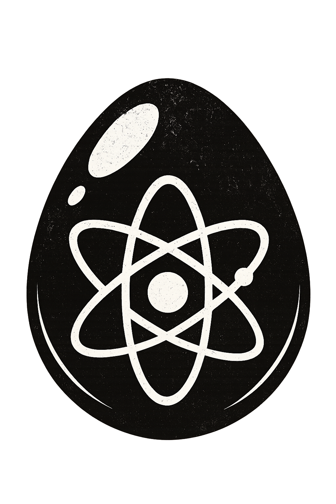
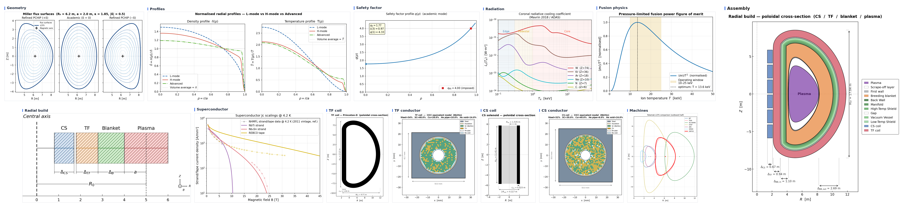

<a name="readme-top"></a>

<p align="center">
  
</p>

<h1 align="center">D0FUS</h1>

<p align="center">
  <a href="https://cecill.info/licences/Licence_CeCILL-C_V1-en.html"></a>
  <a href="https://pypi.org/project/d0fus/"></a>
</p>

<p align="center">
  
</p>

<p align="center">
  <sub>Top: plasma geometry (Miller surfaces), kinetic profiles, safety factor, radiative cooling, and fusion reactivity. Bottom: radial build, superconductor critical current, TF and CS coil cross-sections, CICC conductors, and a multi-machine comparison. Right: the full poloidal radial build, from plasma out to the TF coil.</sub>
</p>

**D0FUS** (Design 0-dimensional for Fusion Systems) is a Python tokamak systems code for fast 0D/1D design-space exploration, covering plasma physics, superconducting magnet engineering, and techno-economic assessment. It is developed at CEA-IRFM.

About 39 000 lines of pure Python: a core library of seven modules and over 500 functions, plus five execution modes. The code is fully documented in the PhD thesis of T. Auclair (2026), whose Appendix D serves as the reference manual; release **v2.7.0** is the version archived with the thesis.

---

## Highlights

- **Pure Python**, NumPy/SciPy only. No compilation, runs in Spyder, Jupyter or as a batch job.
- **Two fidelity levels** (Academic and Refined), with a per-model selector in `GlobalConfig` for any mixed combination, and `preset_academic()` / `preset_refined()` factories for coherent sets.
- **Five execution modes** (RUN, SCAN, OPTIMIZATION, POPCON, UNCERTAINTY), auto-detected from the input file syntax.
- **Library mode**: every function is callable in isolation, outside the solver loop.
- **Distinctive engineering scope**: radially graded TF coils, REBCO Jc scalings, three TF mechanical configurations (wedging, bucking, plug), quench-protection sizing.

---

## Installation

### Option A — Spyder standalone (recommended, no Python knowledge required)

1. Install Spyder from [spyder-ide.org](https://www.spyder-ide.org/) (bundled Python included).
2. Get the code: `git clone https://github.com/IRFM/D0FUS.git`, or **Code → Download ZIP** on [github.com/IRFM/D0FUS](https://github.com/IRFM/D0FUS) and extract.
3. In Spyder, **File → Open…** `D0FUS.py`. The working directory is set to `D0FUS/` automatically.
4. In the IPython console: `%pip install -r requirements.txt` (falls back to `!pip install -r requirements.txt` if `%pip` fails).
5. Press **F5** and select `D0FUS_INPUTS/1_run_ITER.txt` in the file picker. Results print to the console, figures open automatically.

### Option B — Miniforge (conda users)

```bash
conda create -n d0fus python=3.11 && conda activate d0fus
conda install pip spyder
git clone https://github.com/IRFM/D0FUS.git && cd D0FUS
pip install -r requirements.txt
python D0FUS.py D0FUS_INPUTS/1_run_ITER.txt
```

### Option C — pip (headless / library use)

```bash
pip install d0fus
```

Deck-driven run from a script or terminal:

```python
from D0FUS_EXE import D0FUS_run
D0FUS_run.main("D0FUS_INPUTS/1_run_ITER.txt")   # full run + report files + figures
```

Programmatic single point, no files involved:

```python
from dataclasses import replace
from D0FUS_BIB.D0FUS_parameterization import DEFAULT_CONFIG
from D0FUS_EXE import D0FUS_run

cfg = replace(DEFAULT_CONFIG, R0=8.0, Bmax_TF=13.0, Supra_choice="REBCO")
results = D0FUS_run.run(cfg)   # tuple of 93 scalar outputs (np.nan if no solution)
```

> Input decks (`D0FUS_INPUTS/`) are not shipped in the PyPI package: clone the repository to get them.

---

## Project structure

```
D0FUS/
├── D0FUS_BIB/                       # Core library
│   ├── D0FUS_import.py                  # Centralised imports
│   ├── D0FUS_parameterization.py        # Physical constants, GlobalConfig dataclass
│   ├── D0FUS_physical_functions.py      # Plasma physics (profiles, limits, currents, exhaust, RE)
│   ├── D0FUS_radial_build_functions.py  # Magnets (TF/CS, CICC, quench, ripple)
│   ├── D0FUS_cost_functions.py          # Techno-economics (Sheffield, Whyte)
│   ├── D0FUS_cost_data.py               # Reference cost data
│   └── D0FUS_figures.py                 # Figure catalogue
├── D0FUS_EXE/                       # Execution modes
│   ├── D0FUS_run.py                     # Single design point
│   ├── D0FUS_scan.py                    # 2D parameter scan
│   ├── D0FUS_genetic.py                 # Genetic optimisation
│   ├── D0FUS_popcon.py                  # POPCON operating-space map
│   └── D0FUS_uncertainty.py             # Monte-Carlo uncertainty propagation
├── D0FUS_INPUTS/                    # Example decks, 1_run_ITER.txt … 5_popcon_ITER.txt
├── D0FUS_OUTPUTS/                   # Auto-created, timestamped result folders
├── D0FUS.py                         # Entry point (mode auto-detection)
├── pyproject.toml · requirements.txt · CITATION.cff
└── README.md
```

---

## Execution modes

The mode is detected from the input file syntax:

| Mode | Purpose | Trigger in the deck |
|------|---------|---------------------|
| **RUN** | Single design point, 93 outputs, report files, 17 figures | Fixed values only (`R0 = 9`) |
| **SCAN** | 2D feasibility map, 32 registered output quantities | Exactly 2 entries `[min, max, n_points]` |
| **OPTIMIZATION** | Genetic cost minimisation (DEAP) | 2+ entries `[min, max]` |
| **POPCON** | Operating map (n̄, T̄) at fixed machine | `[POPCON]` section |
| **UNCERTAINTY** | Monte-Carlo propagation of input uncertainties | `[UNCERTAINTY]` section |

**RUN** solves the coupled design point: in pulsed mode a scalar root-finding on the helium ash fraction (Brent), in steady-state a 2D solve on (f_α, Q) (Powell). Post-convergence: TF/CS sizing, flux budget, divertor loads, L-H margin, costs, runaway-electron indicators.

**SCAN** evaluates an independent grid in parallel (`joblib`/`loky`), overlaying the operational limits (Greenwald, Troyon, kink) and the radial-build closure on any registered output.

**OPTIMIZATION** minimises `COE` (default), `C_invest`, `volume`, or maximises `P_elec`, under soft penalties on the plasma limits and an optional capital-cost ceiling, so the search converges toward the feasible boundary rather than fleeing it.

**POPCON** freezes the deck's converged machine and sweeps (n̄_line, T̄), returning Q, powers and the H-mode access margin at every node, bounded by the Greenwald and L-H limits (logic of the open-source `cfspopcon`, reusing the D0FUS physics chain).

**UNCERTAINTY** assigns distributions (`norm()`, `tri()`, `unif()`) to any inputs and discrete model switches with `envelope(A | B)`, draws Latin-Hypercube samples, and returns output distributions with feasibility shares, the no-solution draws being counted as failures.

### Execution time (14-core laptop)

| Mode | Configuration | Wall time |
|------|---------------|-----------|
| RUN | single point | ~200 ms |
| SCAN | 50 × 50 grid | ~25 s |
| OPTIMIZATION | 50 × 10 generations | ~2 min 30 |
| POPCON / UNCERTAINTY | N nodes or samples | ~N × 200 ms / n_cores |

---

## Two fidelity levels

Each model carries its own selector in `GlobalConfig`; the factories `preset_academic()` and `preset_refined()` set a coherent bundle. Both levels share the same interface and solver, with comparable run times.

| Model | Academic | Refined |
|-------|----------|---------|
| Plasma geometry | Elliptical torus | Miller flux surfaces, κ(ρ), δ(ρ) |
| Volume element | V′ = 4π²R₀a²κρ | Numerical Miller Jacobian |
| Bootstrap current | Segal-Cerfon-Freidberg fit | Sauter (1999/2002) refitted by Redl (2021) |
| q(ρ) profile | Parametric j(ρ) ∝ (1−ρ²)^αJ | Self-consistent Picard on j_Ω + j_CD + j_bs |
| Resistivity | Spitzer | Sauter/Redl neoclassical |
| TF stress model | Thin-cylinder, two-layer | Thick-cylinder, composite CICC (or CIRCE0D) |
| CS stress model | Hoop only | Hoop + axial fringe-field |

---

## Inputs

All parameters live in one typed dataclass, `GlobalConfig` (149 fields), each with a physically motivated default. A deck overrides only what it names; everything else keeps its default, so a complete machine fits in a few lines:

```ini
R0 = 7
Bmax_TF = 14
Supra_choice = REBCO
```

Key parameters and their actual defaults:

| Parameter | Description | Default | Options |
|-----------|-------------|---------|---------|
| `P_fus` / `R0` / `a` / `b` | Fusion power [MW], radii [m], blanket+shield [m] | 2000 / 9.0 / 3.0 / 1.2 | |
| `Bmax_TF` / `Bmax_CS_adm` | Peak field on TF / admissible on CS [T] | 12.0 / 25.0 | |
| `Supra_choice` | Superconductor | `Nb3Sn` | `NbTi`, `Nb3Sn`, `REBCO` |
| `Choice_Buck_Wedg` | TF mechanical configuration | `Wedging` | `Wedging`, `Bucking`, `Plug` |
| `Chosen_Steel` | Structural steel | `316L` | `316L`, `N50H`, `Manual` |
| `Scaling_Law` | Confinement scaling | `IPB98(y,2)` | `ITPA20`, `ITPA20-IL`, `DS03`, `L-mode`, `L-mode OK`, `ITER89-P` |
| `Option_Kappa` | Elongation model | `Blend` | `Wenninger`, `Stambaugh`, `Freidberg`, `Manual` |
| `Option_q95` | q₉₅ formula | `ITER_1989` | `Sauter` |
| `density_limit_model` | Density limit | `greenwald` | `zanca`, `giacomin` |
| `Plasma_profiles` | Profile preset | `H` | `L`, `Advanced`, `EU-DEMO`, `Manual` |
| `Bootstrap_choice` | Bootstrap model | `Sauter-Redl` | `Segal` |
| `Operation_mode` | Scenario | `Pulsed` (3600 s, 50 MW) | `Steady-State` |
| `CD_source` | Current-drive model | `Academic` (γ_CD 0.20, η_WP 0.40) | `LHCD`, `ECCD`, `NBCD`, `Multi` |
| `Zeff` | Effective charge | computed from the impurity inventory | or fixed value |
| `rho_rad_core` | Core/edge radiation boundary | 0.6 | 1.0 = conservative preset |
| `cost_model` | Cost model | `Sheffield` | `Whyte`, `None` |

The complete field list, with units, defaults and provenance comments, is in `D0FUS_parameterization.py`, reproduced in Appendix D of the thesis; every run also writes it to `output_detailed.txt`.

### Deck syntax by mode

```ini
# RUN: fixed values                    # SCAN: exactly two brackets
R0 = 9                                 R0 = [3, 9, 25]
Bmax_TF = 13                           a  = [1, 3, 25]

# OPTIMIZATION: 2+ ranges              # POPCON: full RUN deck, then
R0 = [3, 9]                            [POPCON]
Bmax_TF = [10, 16]                     nbar_line = [0.35, 1.45, 45]
fitness_objective = COE                Tbar      = [3.5, 24.0, 36]

# UNCERTAINTY: full RUN deck, then
[UNCERTAINTY]
H           = norm(0.75, 1.50)                # truncated normal around the deck value
Scaling_Law = envelope(IPB98(y,2) | ITPA20)   # model switch (pipe-separated)
[CONTROLS]
n_samples = 1500
```

Continuous distributions: `norm(sigma)`, `norm(lo, hi)`, `norm(lo, centre, hi)`, `tri(...)`, `unif(lo, hi)`. One worked example per mode ships in `D0FUS_INPUTS/`.

---

## Outputs

Every mode writes a timestamped folder under `D0FUS_OUTPUTS/`. A RUN produces `input_parameters.txt` (the deck), `output_highlight.txt` (key results), `output_detailed.txt` (every input including defaults, every output), and 17 figures (cross-section, Miller surfaces, profiles, q(ρ), radiation, divertor two-point, radial build, coil and CICC drawings, cost breakdown, temperature and density maps, optional PyVista 3D view). SCAN writes the 2D map, OPTIMIZATION the convergence history and Hall of Fame, POPCON the operating-contour map, UNCERTAINTY the per-output distributions with the feasibility verdict and figures.

---

## Models in brief

Plasma geometry follows the Miller parameterisation (Miller 1998) with on-axis regularity enforced (Ball & Parra 2015). The three first-order plasma limits are Greenwald, Troyon and the kink limit on q₉₅, with the density-limit model selectable (Greenwald, Zanca 2019, Giacomin 2022 near-separatrix). Impurity radiation uses the Mavrin (2018) cooling rates; the divertor is characterised by an Eich attached estimate or a two-point model with a Lengyel seeding closure on non-coronal OpenADAS curves. The L-H threshold offers Martin (2008) and two Delabie (ITPA TC-26) regressions. Current drive follows the METIS efficiency models, matched to METIS within 1.5 %. Runaway-electron indicators combine a hot-tail seed (Smith 2008) and avalanche amplification (Breizman 2019), for comparative ranking only.

The TF inboard leg is a Princeton-D (File, Mills & Sheffield 1971); conductors are CICC-like with a helium-fraction hierarchy; critical currents use ITER parameterisations (NbTi, Nb₃Sn) and REBCO datasets (Senatore 2024, Fujikura 2019); quench protection is sized on the Maddock hot-spot criterion; the winding pack can be radially graded. Costing follows Sheffield & Milora (2016), with a surface-proportional Whyte (2024) model for cross-checks; costs never feed back into the physics.

Full derivations, validity domains and references: thesis, Chapter 1 and Appendices B-C.

---

## Version and citation

To cite D0FUS, use `CITATION.cff` (GitHub's *Cite this repository* button) or cite the thesis:

> T. Auclair, *Apport des supraconducteurs à haute température critique au dimensionnement de machines de fusion nucléaire par confinement magnétique*, PhD thesis, Aix-Marseille Université / CEA-IRFM, 2026.

---

## Contributing

Contributions and questions are welcome: timothe.auclair@cea.fr

## License

[CeCILL-C](https://cecill.info/licences/Licence_CeCILL-C_V1-en.html), a French free software license compatible with the GNU LGPL. See [LICENSE](LICENSE).

© 2025-2026 CEA/IRFM

<p align="right">(<a href="#readme-top">back to top</a>)</p>
